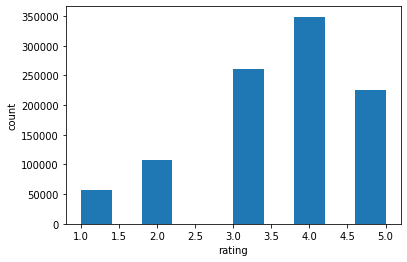

# CS6220-HW3
Model based Collaborative Filtering.

## Dataset

I am using [MovieLens1M dataset](https://grouplens.org/datasets/movielens/1m/). The dataset contains 6040 users, 3706 movies that are rated by users, ratings has 5 levels (1,2,3,4,5). 
The entries in the dataset look like this 

|    |   user_id |   movie_id |   rating |        time |
|---:|----------:|-----------:|---------:|------------:|
|  0 |         1 |       1193 |        5 | 9.78301e+08 |
|  1 |         1 |        661 |        3 | 9.78302e+08 |
|  2 |         1 |        914 |        3 | 9.78302e+08 |
|  3 |         1 |       3408 |        4 | 9.783e+08   |
|  4 |         1 |       2355 |        5 | 9.78824e+08 |

The datasets also contains information about the movies as reference. This is not needed when training the model.

|    |   movie_id | title                              | genre                        |
|---:|-----------:|:-----------------------------------|:-----------------------------|
|  0 |          1 | Toy Story (1995)                   | Animation|Children's|Comedy  |
|  1 |          2 | Jumanji (1995)                     | Adventure|Children's|Fantasy |
|  2 |          3 | Grumpier Old Men (1995)            | Comedy|Romance               |
|  3 |          4 | Waiting to Exhale (1995)           | Comedy|Drama                 |
|  4 |          5 | Father of the Bride Part II (1995) | Comedy                       |

The average rating is 3.58. 
The distribution of the ratings are shown below.

I took 600 users out of the 6040 users as testset. 

## Model Specification

The implementation closely follows [this](https://analyticsindiamag.com/singular-value-decomposition-svd-application-recommender-system/) tutorial. I made some changes to improve the performance of the model as well as to quantify the accuracy. 

The rating matrix is first filled with user-median ratings for each user. Then the rating matrix is normalized before the SVD is applied.

First define an accuracy metric where:

For each user in the test set, given a movie that a user rated highest as input to the model, the model outputs movies that are similar to the one the user likes.

accuracy =1 if the model recommended a movie that the user rated higher than the user's median score accuracy = 0 if the model recommended a movie that the user rated lower than the user's median score

The user is not considered if the model's recommended movies are not rated by the user. So we can not evaluate the model's performance for this user.

The models are trained by tuning the number of principal components.

## compuation time

The total training/computation time takes 31 seconds mainly the SVD decomposition. 

## test example

### Recommendations for Star Wars: Episode IV - A New Hope (1977) 

|      | title                                                              | genre                               |
|-----:|:-------------------------------------------------------------------|:------------------------------------|
|  108 | Braveheart (1995)                                                  | Action|Drama|War                    |
| 1178 | Star Wars: Episode V - The Empire Strikes Back (1980)              | Action|Adventure|Drama|Sci-Fi|War   |
| 1180 | Raiders of the Lost Ark (1981)                                     | Action|Adventure                    |
| 1192 | Star Wars: Episode VI - Return of the Jedi (1983)                  | Action|Adventure|Romance|Sci-Fi|War |
| 1271 | Indiana Jones and the Last Crusade (1989)                          | Action|Adventure                    |
| 1396 | Message to Love: The Isle of Wight Festival (1996)                 | Documentary                         |
| 2522 | Jeanne and the Perfect Guy (Jeanne et le garçon formidable) (1998) | Comedy|Romance                      |
| 2559 | Star Wars: Episode I - The Phantom Menace (1999)                   | Action|Adventure|Fantasy|Sci-Fi     |
| 3470 | Filth and the Fury, The (2000)                                     | Documentary                         |
| 3724 | X-Men (2000)                                                       | Action|Sci-Fi                       |

### Recommendations for Braveheart (1995)

|      | title                                                              | genre              |
|-----:|:-------------------------------------------------------------------|:-------------------|
|   36 | Across the Sea of Time (1995)                                      | Documentary        |
|  315 | Shawshank Redemption, The (1994)                                   | Drama              |
|  352 | Forrest Gump (1994)                                                | Comedy|Romance|War |
| 1613 | Hurricane Streets (1998)                                           | Drama              |
| 1959 | Saving Private Ryan (1998)                                         | Action|Drama|War   |
| 2522 | Jeanne and the Perfect Guy (Jeanne et le garçon formidable) (1998) | Comedy|Romance     |
| 3257 | What Planet Are You From? (2000)                                   | Comedy|Sci-Fi      |
| 3509 | Gladiator (2000)                                                   | Action|Drama       |
| 3684 | Patriot, The (2000)                                                | Action|Drama|War   |
| 3692 | Blood In, Blood Out (a.k.a. Bound by Honor) (1993)                 | Crime|Drama        |    |

### Recommendations for Jurassic Park (1993) Genre Action|Adventure|Sci-Fi
Recommendations for Jurassic Park (1993) Genre Action|Adventure|Sci-Fi

|      | title                             | genre                            |
|-----:|:----------------------------------|:---------------------------------|
|  585 | Terminator 2: Judgment Day (1991) | Action|Sci-Fi|Thriller           |
|  770 | Independence Day (ID4) (1996)     | Action|Sci-Fi|War                |
| 1180 | Raiders of the Lost Ark (1981)    | Action|Adventure                 |
| 1182 | Aliens (1986)                     | Action|Sci-Fi|Thriller|War       |
| 1196 | Alien (1979)                      | Action|Horror|Sci-Fi|Thriller    |
| 1220 | Terminator, The (1984)            | Action|Sci-Fi|Thriller           |
| 1366 | Jaws (1975)                       | Action|Horror                    |
| 2693 | Sixth Sense, The (1999)           | Thriller                         |
| 2847 | Total Recall (1990)               | Action|Adventure|Sci-Fi|Thriller |
| 3458 | Predator (1987)                   | Action|Sci-Fi|Thriller           |

## accuracy

The testset contains a list of users. My way of evaluating accuracy requires the user actually rated the recomended movies. The testset for the Top1 accuracy is very small since not all the users rated the top 1 recomended moview. The top2 accuracy is reported here instead.

|Top2 Accuracy (%)|K|Prediction Time (all sample)|
|:----|:-----|:---|
|50|2|2.1s|
|69.4|5 |1.3s|
|62.5|10|1.9s
|54.9|20|1.6s

|Top5 Accuracy (%)|K|Prediction Time (all sample)|
|:----|:-----|:--|
|38.1|2|1.4s
|57.5|5|1.4s
|72.1|10|1.9s
|51.6|20|2.3s

## Analysis of Results

The model-based approach is very efficient for large datasets. For this dataset with 1M entries. After training the SVD based model, the only important information is stored in the first few principal components (In my case, the first 5-10 principal components), this sufficiently reduces the dimensionality of the problem, whereas the memory-based approach does not scale well as the data gets large. 